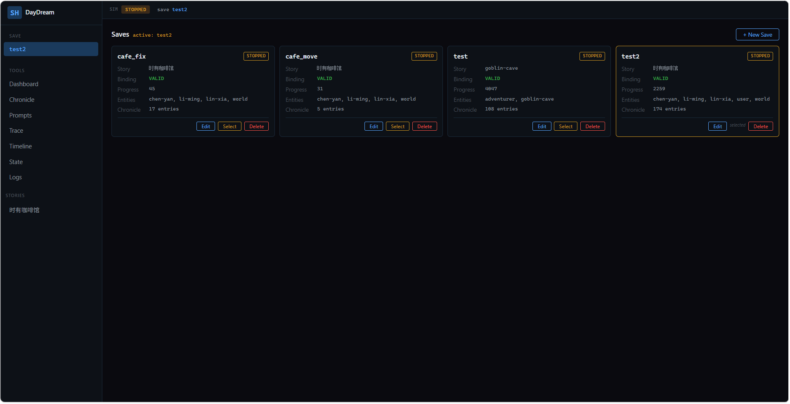
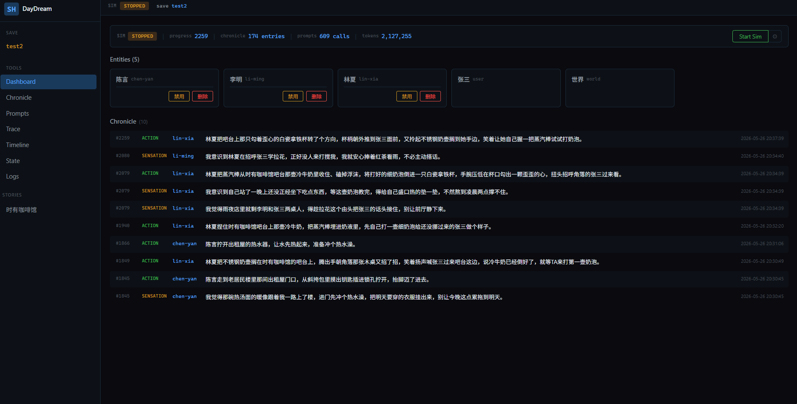
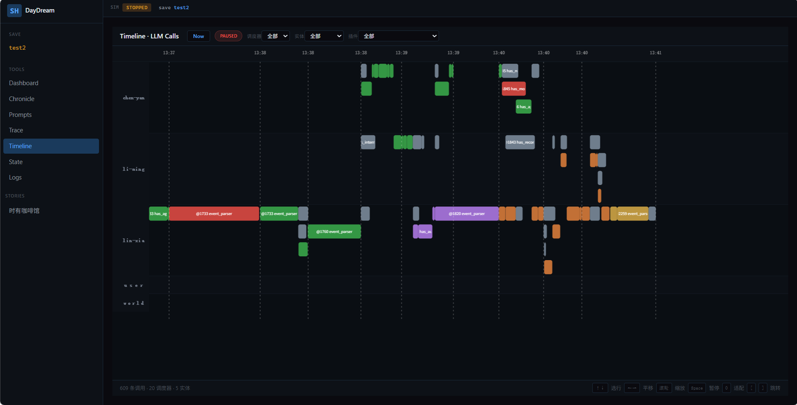
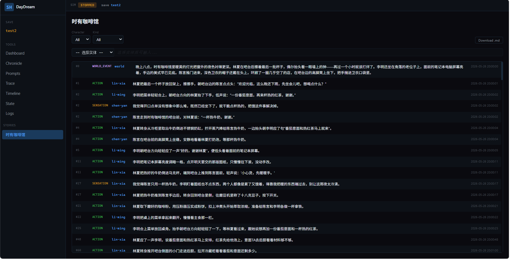
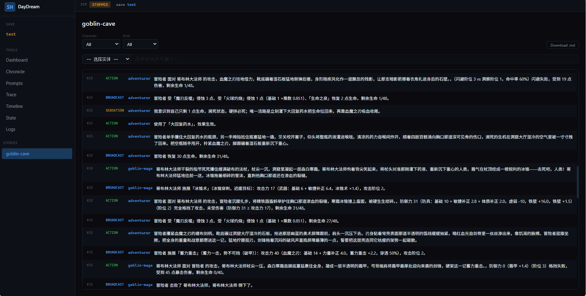
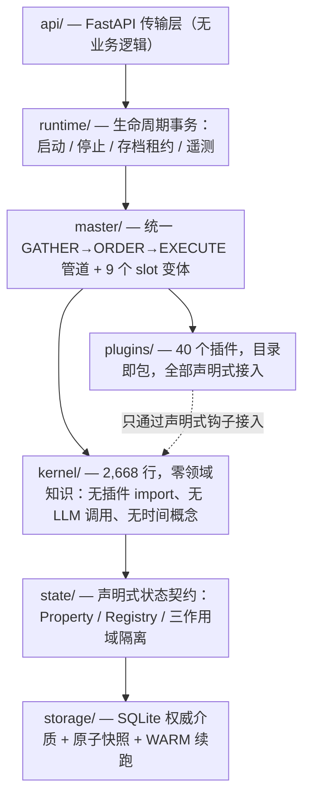

# DayDream — 多角色并行叙事引擎

> 一个人 + AI 协作，约 4 个月（2026.5–2026.9），**2,305 次提交**：**43,089 行** Python 后端（328 文件）+ **46,013 行**测试（215 文件 / **3,078** 个用例）+ **9,141 行** React / TypeScript 前端。

**角色不是等用户说话的布景板，而是有独立时间线、自主行动的 agent。** 代码承担叙事结构（时间、空间、记忆、状态机），LLM 只负责生成语言和理解意图。

---

## 目录

- [项目定位](#项目定位)
- [解决什么问题](#解决什么问题)
- [运行截图](#运行截图)
- [架构总览](#架构总览)
- [三条核心技术线](#三条核心技术线)
- [其它值得一读的设计](#其它值得一读的设计)
- [与并行 / 分布式领域的关联](#与并行--分布式领域的关联)
- [工程方法与质量基线](#工程方法与质量基线)
- [路线图](#路线图)
- [文档导航](#文档导航)

---

## 项目定位

**不做酒馆，做叙事引擎。**

SillyTavern 这类角色扮演产品里，"角色"只是等用户说话的布景板——没有自己的生活，没有真实时间线，故事靠 prompt 和上下文窗口硬撑，一长就崩。本项目把"角色世界"当作一个真正的运行时来写：

- 每个角色是一条**独立推进的时间线**，只在交互时合并；
- 事件在角色之间**异步投递**，每个角色只拿到自己视角的信息；
- 记忆按**遗忘曲线**衰减，长篇故事的 token 不随章节数线性增长；
- 一次昂贵的 LLM 生成被**信息密度分离**成两次消费，多角色场景成本近似常数。

**护城河不在"用 LLM 做了什么"，在"不用 LLM 做了什么"**——时间推进、记忆衰减、空间计算、状态机逻辑全部由确定性代码承担。确定性代码不会被更大的模型取代。

## 解决什么问题

| 维度 | SillyTavern 类产品 | Stanford Generative Agents (Smallville, 2023) | **DayDream** |
|---|---|---|---|
| 时间模型 | 单条对话时间线 | 回合制、全局时间步 | **多角色独立时间线，交互时 merge / 分离时 split** |
| 并行度 | 单角色 | 单线程、顺序执行所有 agent | **每实体独立 Scheduler + 私有进度计量器** |
| 记忆 | 上下文窗口 | LLM 检索 + 反思 | **遗忘曲线四区衰减 + LLM 巩固 + 离屏惰性冻结** |
| 成本 | 随上下文线性膨胀 | 每步全量检索 | **信息密度分离，多角色场景近似常数** |
| 贡献侧重 | prompt 工程 | LLM 侧（记忆 / 反思 / 规划） | **系统侧（并行时间线 / 信息不对称投递 / token 工程）** |

与 Smallville 的关系是**正交且互补**的：它关心 LLM 侧，本项目关心系统侧。

## 运行截图

### 1. 存档管理

每个存档记录绑定的剧本（Story）、插件包绑定有效性（Binding）、仿真进度（Progress）、实体清单与编年史条数（Chronicle）。换存档即换世界，进程级注册表不残留——插件目录扫描后被**深度冻结**成不可变 `PluginCatalog` 再注入运行时。

### 2. 运行面板

顶部状态条给出运行时全貌：仿真进度、编年史条数、prompt 调用次数、累计 token 消耗。下方是实体列表与实时编年史流——`ACTION`（外显行为）与 `SENSATION`（内心活动）交错，每条带进度号、角色与日历时间。截图中有 5 个实体、174 条编年史、609 次 LLM 调用、212 万 token。

### 3. LLM 调用时间线

每个实体一条泳道，横轴是日历时间，彩色块代表不同来源的 LLM 调用（事件解析、agency、autopilot……），可缩放、暂停、跳转。底部统计："609 条调用 · 20 调度器 · 5 实体"——可以直接看到**多条时间线各自独立推进**。

### 4. 编年史：现代都市长线生活

同一个咖啡馆场景里，林夏、李明、陈言三条时间线并行推进。角色自主生活、交互、涌现出剧本之外的剧情——`SENSATION` 条目是角色的内心活动，其他角色完全看不到。

### 5. 编年史：奇幻战斗

冒险者与哥布林大法师的对战。`BROADCAST` 条目携带完整数值结算（闪避 / 防御 / 攻击值、各乘数、生命值变化），体现"攻防两段式 + 图鉴-持有 + 自由文本攻击"的战斗体系：LLM 负责描写，代码负责算账。

## 架构总览

依赖严格单向，由 **AST 架构测试**守护——kernel 不 import 任何插件，插件不 import 历法实现，进程级注册表在换存档时零污染。

- **kernel**（2,668 行 / 26 文件）只认识抽象的 `progress(int)` 与 capability 列表，"时间"是可替换的历法插件；
- **master** 只做 GATHER → ORDER → EXECUTE，不知道 `move`、`message` 是什么；
- **plugins** 40 个，按包（`pack.json` + include 链）组合，简单插件一条声明即可接入。

## 三条核心技术线

这个项目的绝大部分价值，来自三条持续收敛的重构线。它们共同的主题是：**每一轮重构都在删除一个特权通道或伪概念，删完之后系统能力反而变强。**

### 一、内核–插件边界：Master 的演变史

系统的天花板不取决于代码量，取决于**接入成本**——如果加一个插件要改十个文件，上限就是十个插件。

| 阶段 | 时间 | 状态 |
|---|---|---|
| 原型 | 5/26–5/29 | 无插件概念，一个 Python 对象 = 人格 + 记忆 + 调度 |
| 插件化成型 | 6/16–6/21 | HumanMaster + GATHER→ORDER→EXECUTE 管道 |
| 管道收敛 | 6/23–6/25 | 所有 action 统一走标准管道，Master 只做排序与执行 |
| Master 统一 | 7/4 | 单一 Master + 9 slot 变体，`on_tick` 零 `entity_type` 分支 |
| 声明化终点 | 8 月 | 插件组合成包 + 插件语言 v2（ECA 规则声明 + 可组合积木） |

→ 详见 [docs/master-evolution.md](docs/master-evolution.md)

### 二、并行内核：Scheduler 的演变史

始于一个领域矛盾：**多角色模拟的因果一致性 vs 并行度。**

**核心洞察**：角色之间大部分时间不需要因果一致——A 做饭、B 看书，两条时间线各自推进毫无问题；只有交互（A 对 B 说话）时才需要共享时间线。据此，Coordinator 管理一组独立 Scheduler，跨实体事件触发 **merge**，5 分钟无交互自动 **split**，drift cap 30 保证时钟不会漂移太远。

这不是性能优化，而是**叙事的正确模型**：男女主各自上班时的心理活动并行推进、下班见面时交汇，多线叙事是引擎原生能力而非补丁。

两轮概念修正同样关键：删除全局时钟 `storage["clock"]`（内核净删 627 行），以及**内核去时间化**（`SimulationClock(datetime)` → `ProgressMeter(int)`，84 文件重构）。

→ 详见 [docs/scheduler-evolution.md](docs/scheduler-evolution.md)

### 三、LLM 渲染管线：维度渲染的演变史

LLM 的 I/O 是双向管线：**上行**把系统状态装配成 prompt，**下行**把叙事文本解析成可投递的结构化信息。

- **上行**：从"每种消费者手写一套渲染"重构为 **4 级信息密度 × 声明式匹配**——插件对每个维度声明一次 `outputs`（detailed / standard / concise / minimal），消费者声明 profile 按需取用，缺失密度右向级联 fallback。
- **下行**：视角翻译 + `code_public` 路由（机械事实走纯代码扫描、原文直投，LLM 解析只保留给真正需要视角翻译的叙事行动）+ `text_utils` 三层文本处理（27 个函数、142 个参数化用例）。
- **核心经济模型——信息密度分离**：一次昂贵 LLM 生成，两次消费。优美原文给读者；parser 剥离 who/what/where 信息核，以 5–10 倍压缩比投递给场景中其他角色。这同时解决了 token 成本（多角色场景近似常数）与叙事质量——**角色只持有不完整信息，"不知情"就是涌现的来源**。

→ 详见 [docs/rendering-pipeline.md](docs/rendering-pipeline.md)

## 其它值得一读的设计

- **记忆系统**：遗忘曲线四区衰减（active 精细保留 → fading 压缩为摘要 → labile 概率丢弃或闪回 → core 永久），LLM 驱动的 consolidation，离开视野的角色状态惰性冻结（offscreen collapse）、重新出现时 LLM 重建补述。
- **持久化与查询**：SQLite 权威介质（变量 / 编年史 / prompt / trace 四表，全部按进度索引）+ 原子快照 + WARM 续跑 + 存档租约；启动是事务性的（失败按逆序 abort，可重试）；查询层是 CQRS 形态——六种 DataSource、live 视图与落盘视图按运行时身份自动切换、跨存档读强制走持久层。
- **涌现实证**：一次仿真中 LLM 地图匹配失误把角色导到了别人家——系统没有纠错，角色自己发现、自己解释（"下雨天脑子一抽走错楼了"），发展出整场最好的剧情。密室辩论同样证明：角色只收到信息核，各自的不知情催生了真实的认知碰撞。
- **Agent 底座**：provider 原生 tool-use（Anthropic 与 OpenAI 兼容双后端），JSON Schema 由 provider 强制；工具按"插件归属 × 消费者白名单"二级过滤；同工具连续 3 次异常熔断；稳定前缀打标启用 Anthropic ephemeral cache。
- **Narrator**：世界实体上的 GM / 读者 / 编剧三合一 agent，按编年史水位线增量观察剧情，必要时干预——但干预走 `inner_voice`（给角色投递内心冲动）而非直接注入事件，**纠正通过内部动机，不通过外力**。

→ 详见 [docs/systems-and-practices.md](docs/systems-and-practices.md)

## 与并行 / 分布式领域的关联

需要诚实说明：这个项目不是先读了分布式论文再实现——是**独立收敛到某个设计后，发现它在成熟领域早有严格表述**。这反而是最有价值的验证：对领域约束的正确思考，最终会落到和几十年演化相同的地方。

| 本项目中的设计 | 对应的领域概念 |
|---|---|
| `confirmed_progress = min(各 scheduler 进度)`，作为全系统事件排序与持久化水位线 | **Lamport 逻辑时钟**（1978） |
| 独立时间线 + 仅交互时 merge | **happens-before 因果序**；merge ≈ 进入同一一致性域 |
| chronicle 稳定区 / 波动区（水位线前不可变） | **一致性地切面 / 分布式快照**（Chandy-Lamport）；event sourcing 的已提交日志 |
| 确认进度驱动的乱序容忍窗 | 流处理中的 **watermark** |
| 单协程写确认进度；GATHER 只读 / EXECUTE 写入 | **单写者原则**（LMAX Disruptor 同款） |
| inbox buffer：追加式日志 + 每消费者独立 mark + GC 取最慢读者位置 | **Kafka 消费者 offset + 日志保留**；epoch-based reclamation |
| entity = 独立调度单元，事件异步投递到 mailbox，tick 时消费 | **Actor 模型** |
| 五层生产者–消费者缓冲、跨 scheduler 异步投递 | 流水线化消息传递，竞态窗口被显式建模而非隐式假设 |
| save.db 追加表 + QueryRouter 读写双视图 | **CQRS** |

记忆系统则有两条学理线索：Ebbinghaus 遗忘曲线的直接工程化，以及互补学习系统理论（海马体→新皮层巩固）的近似——fading 记忆由 LLM 压缩为摘要再"换出"，与记忆巩固的计算模型同构。

→ 详见 [docs/related-work.md](docs/related-work.md)

## 工程方法与质量基线

| 指标 | 实测值 |
|---|---|
| 提交数 | 2,305（含分支），master 2,303 |
| 开发周期 | 2026-05-26 → 2026-09-22，约 4 个月 |
| 后端 Python | 43,089 行 / 328 文件 |
| 测试代码 | 46,013 行 / 215 文件 |
| 测试用例 | 3,078（`pytest --collect-only` 实测） |
| 插件 | 40 个 / 25,017 行（聚合为 16 个插件包） |
| kernel | 2,668 行 / 26 文件 |
| 前端 | 9,141 行 TS / TSX |

测试按 `unit` / `integration` / `contract` / `e2e` 四类组织，无 live-LLM 依赖、无 skip、无 warning。此外：

- **批次制度**：每批次 spec → plan → TDD → 独立复审 → `--no-ff` 合并；
- **合并前彩排**：大批次合并前必须在临时 worktree 跑组合测试——曾抓到"两侧单测全绿、组合后 18 个失败"的连接泄漏；
- **性能先测基线**：据此发现 SQLite 每条记录新建连接的代价是连接复用的 55 倍，砍在了真正流血的地方；
- **AI 写代码、AI 互审**，驳回记录全部落盘；
- **AST 架构测试**守护依赖单向规则。

## 路线图

- **奇幻开放世界场景与战斗内容层**待扩展（战斗 / 效果体系已就绪，完整开放世界尚未跑通）；
- **剧本插件生态**：二创 = 选包 + 配参数 + 写规则，插件语言 v2 已打好底座；
- **宏观故事结构层**：章节管理、情节种子、结局收敛。

当前刻意停在**运行时收敛优化**（持久化职责收敛、运行时资源单一所有权与停机取消语义、测试与复审制度）——先让地基不晃，再往上盖。

## 文档导航

| 文档 | 内容 |
|---|---|
| [docs/architecture.md](docs/architecture.md) | 分层架构、依赖单向规则、目录职责 |
| [docs/master-evolution.md](docs/master-evolution.md) | 内核–插件边界：Master 演变史 |
| [docs/scheduler-evolution.md](docs/scheduler-evolution.md) | 并行内核：Scheduler 演变史 |
| [docs/rendering-pipeline.md](docs/rendering-pipeline.md) | LLM 渲染管线：维度渲染演变史 |
| [docs/systems-and-practices.md](docs/systems-and-practices.md) | 记忆系统、持久化、查询层、工程制度 |
| [docs/related-work.md](docs/related-work.md) | 与并行 / 分布式领域的映射与对比 |

---

> 本仓库为**作品展示仓库**，只包含设计文档与截图，**不包含源码**。源码与全部工程资产保留所有权利。
