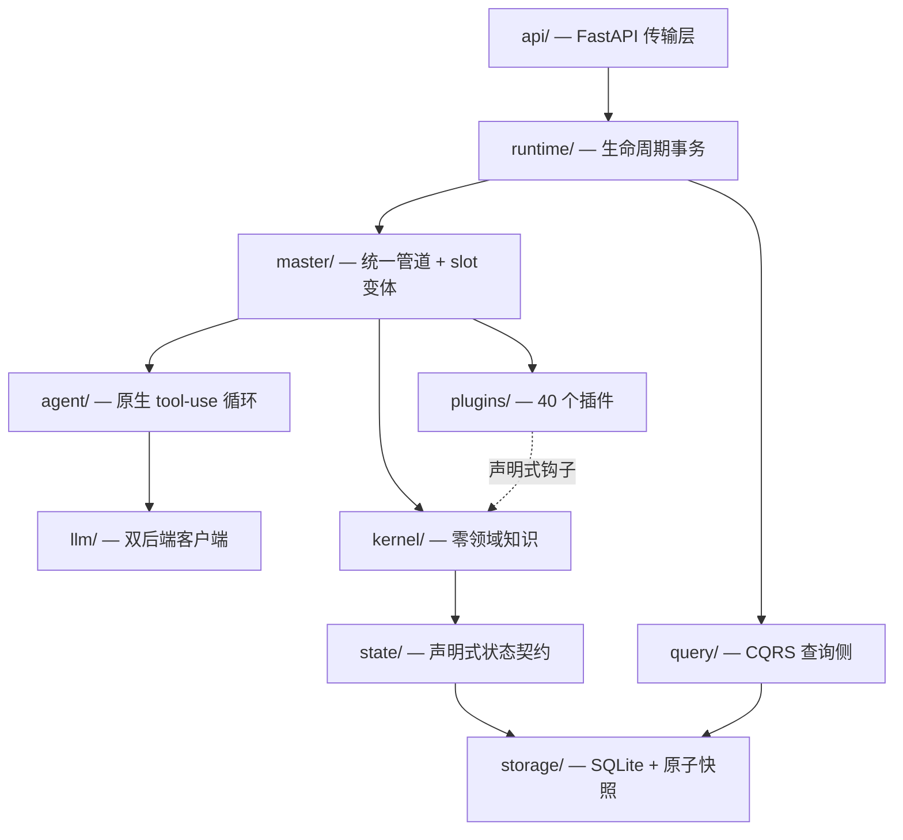

# 架构总览

> 依赖严格单向，由 **AST 架构测试**守护。kernel 不 import 任何插件，插件不 import 历法实现，进程级注册表在换存档时零污染。

## 分层

```
run.py → src/api/app.py (FastAPI factory)
  api/       FastAPI 传输层（无业务逻辑）
  runtime/   生命周期事务：启动 / 停止 / 存档租约 / 遥测
  plugins/   40 个插件，聚合为 16 个包，全部声明式接入
  master/    统一 GATHER→ORDER→EXECUTE 管道 + 9 个 slot 变体
  agent/     provider 原生 tool-use 多轮循环
  llm/       LLM 客户端（Anthropic / OpenAI 兼容双后端）
  kernel/    2,668 行：零领域知识——无插件 import、无 LLM 调用、无时间概念
  state/     声明式状态契约（Property / Registry / 三作用域隔离）
  storage/   SQLite 权威介质 + 原子快照 + WARM 续跑
  query/     进度索引的多源数据访问（CQRS 查询侧）
  save/      存档路径解析 + 错误类型
  models/    共享数据模型
```



## 依赖规则（硬约束）

| 规则 | 含义 | 守护方式 |
|---|---|---|
| kernel zero-domain | kernel 只知道 entity id + capability 列表，不 import 任何插件 | AST 架构测试 |
| kernel 无时间概念 | 内核只认识抽象 `progress(int)`，时间字符串只经 Master 中介进入 LLM 上下文 | AST 测试 + 单测 |
| kernel 无 LLM | 内核不存在 LLM 调用 | AST 测试 |
| 插件不 import 历法实现 | 需要历法时通过 `ServiceResolver` 按 role 解析 | 约定 + 测试 |
| 进程级注册表消失 | 插件目录扫描 → 冲突校验 → 深度冻结成不可变 `PluginCatalog`，换存档零污染 | registry-isolation 回归测试 |

## 关键子系统

### kernel

| 模块 | 职责 |
|---|---|
| `coordinator` | 顶层循环：实体准入门、merge / split、spawn drain、tick、快照落盘、drift |
| `scheduler` | 每实体 tick 循环，持有**私有** `ProgressMeter` |
| `progress` | `ProgressMeter` + `EventQueue`，内核进度原语 |
| `task_queue` | 每实体优先队列 + `_TaskCollector`（去重键为 `(entity, when)`） |
| `deliver` | `EventBean` + 机械分发（无 LLM）：写编年史、检测跨 scheduler |
| `inbox_buffer` | 公开 inbox 缓冲：Master 写、插件读、按最慢读者 GC |
| `typed_actions` | wrapper 动作分类：get / set / clear |
| `entity_admission` | 不可变准入门请求、就绪 / 结果契约、恢复队列与调度元数据 |
| `capability` | `Capability` 基类、`ActionResult`、`TickIntent` |
| `service` | `ServiceResolver`：按 role 在**已冻结**的 catalog 上做每运行时解析 |
| `text_utils/` | 三层文本处理工具包（extract → normalize → clean） |

### master

- `pipeline` 是稳定门面，对外只暴露 `process_entity` / `deliver_event` / `on_tick`；
- 内部 GATHER → ORDER → EXECUTE 由 `tick_pipeline` 编排，`action_executor` 负责冷却构造与执行分发；
- **9 个 slot 变体**：`event_header` / `accept_event` / `self_perspective` / `code_perspective` / `should_skip` / `skip_reason` / `before_gather` / `enact_action` / `route_event`；
- 未注册的 slot 落到内置 identity / noop 默认，每个实体在 `config.json` 里用 `"slots": {"*": "character"}` 自由组合。

### plugins

**目录即包**：`src/plugins/<包名>/`，包成员 = 直接含 `pack.json` 的插件。包之间通过 include 链组合：

```
fantasy_human = basic_human + basic_combat + …
modern_human  = basic_human + relationships + spatial + social_role + …
```

当前 40 个插件，分布为：

| 包 | 插件数 | 内容 |
|---|---|---|
| `basic_human` | 6 | environment / intention / mental_activity / mood / personality / public_profile |
| `basic_combat` | 10 | has_dice 体系：equipment / items / skills / panel / effects / satiety / food / currency / gazetteer / combat_terminal |
| `modern_human` | 6 | destiny / fortune / lifestyle / modern_physiology / relationships / spatial |
| `modern_world` | 3 | atmosphere / modern_chronology / weather |
| `basic_world` | 4 | narrator / chronicle_reader / dimension_reader / character_factory |
| `basic_creator` | 3 | basic_profile / record / social_role |
| `event_engine` | 2 | agency / autopilot |
| `core` | 3 | action_output / has_user_input / heartbeat_tick |
| `basic_monster` | 1 | has_monster |
| `has_history` / `has_soul` | 1 + 1 | 历史 / 人格底座 |
| **合计** | **40** | 25,017 行 |

### state

`Property` 声明 key / type / scope / default / persist / codec / owner；`PropertyRegistry` 负责注册、冲突校验与冻结；`VariableManager` 暴露 `storage.vars` 并做路由与校验。三个私有后端按作用域隔离：

```
SimState（仅组合）
  ├── VariableManager（storage.vars 对外入口）
  ├── PropertyRegistry（冻结后不可变）
  ├── entity_container   私有 entity 作用域
  ├── plugin_container   私有 plugin 作用域
  └── kernel_container   私有 kernel 作用域
```

### storage / query

- **SQLite 权威介质**：变量、编年史、prompt、trace 四表，全部**按进度索引**；
- **原子快照** + WARM 续跑 + 存档租约；
- **启动是事务性的**：失败按逆序 abort，可重试；
- **查询侧是 CQRS**：六种 DataSource，live 视图与落盘视图按运行时身份自动切换，跨存档读强制走持久层。

### api / runtime

`api` 只做传输，不含业务逻辑。`runtime.SimulationManager` 负责仿真生命周期的单一所有权：启动、停止、暂停、恢复、每运行时 catalog 与存档租约。启动后 sim 未运行，需显式 `POST /api/sim/start`。
