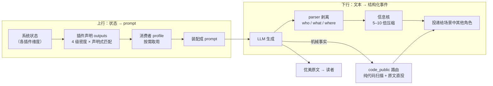

# 三、LLM 渲染管线：维度渲染的演变史

> LLM 的 I/O 是双向管线：**上行**把系统状态装配成 prompt（上下文渲染），**下行**把叙事文本解析成可投递的结构化信息。两端的成本和保真度决定整个系统的经济性。



## 上行演变——从手写渲染到声明式密度系统

**早期**：每种消费者（自己视角 / 他人视角 / parser）各自手写一套渲染方法，插件每多一个消费场景就多一份渲染代码。

**第 5 周重构为 4 级信息密度 × 声明式匹配**：

- 插件对每个维度声明一次 `outputs`：`detailed` / `standard` / `concise` / `minimal` 四级各一个渲染函数；
- 消费者声明 profile 按需取用，例如：

```jsonc
// agency：外部事件需要完整信息
{ "*": "detailed" }

// parser：只要能定位 who/what/where，记忆维度几乎不需要
{ "*": "concise", "memory": "minimal" }
```

- 缺失密度右向级联 fallback（要 `detailed` 但只有 `standard` → 取 `standard`）。

一个声明覆盖所有消费者，新增消费场景零渲染代码。

配套 **5 种装配 style**（分节 / 实体卡片 / 行内 / dict / raw），支持多实体一次装配——parser 给场景里每个角色各生成一张上下文卡片，全局维度自动排除，实体维度加名字前缀。

同构地，动态规则、wrapper 动作菜单、工具面都收敛为同一条"**声明–收集**"pull 模式。

## 核心经济模型——信息密度分离

> 一次昂贵 LLM 生成，两次消费。

1. **优美原文**给读者看；
2. parser 剥离出 who / what / where **信息核**，以 **5–10 倍压缩比**投递给场景中其他角色；
3. 下游角色基于信息核（而非全文）反应。

这同时解决了两个问题：

- **token 成本**：多角色场景成本近似常数，不随参与者数量线性膨胀；
- **叙事质量**：角色只持有不完整信息，"**不知情**"是涌现的来源——每个角色基于自己收到的视角行动，误会、惊喜、信息差全部自然发生。

## 下行演变——解析成本与失真的持续压缩

- **视角翻译**：parser 不只判断"谁受影响"，还为每个受影响角色生成第一人称视角转译（"林夏推门进来" → 李明视角的收件文本）。
- **`code_public` 路由**（8 月）：发现机械事实（战斗播报、状态广播）也走 LLM parser 既烧钱又有失真风险，改为**纯代码扫描确定受影响者、原文直投**——LLM 解析只保留给真正需要视角翻译的叙事行动。
- **`text_utils` 三层文本处理**（提取 → 规范化 → 清洗，27 个函数、142 个参数化用例）：LLM 输出的 JSON 纠错（markdown 围栏、全角引号、尾逗号修复）、代词替换、事件文本清洗，全部边界情况有测试。

## Agent 底座（第 7 周）

从"prompt 拼接 JSON"的 legacy loop 迁移到 **provider 原生 tool-use**：

| 层 | 内容 |
|---|---|
| L1 | `LLMClient.call_agent(cfg, messages, tools) -> AgentTurn`，Anthropic 原生 tool-use + cache_control / OpenAI 兼容 function-calling（DeepSeek 等）双后端 |
| L2 | `ToolDef { name, description, schema(JSON Schema), execute, repeatable, is_exit }`，`to_openai()` / `to_anthropic()` |
| L3 | `run_agent_loop` 维护真 message transcript，工具调用走 provider 原生 API |

关键工程点：

- JSON Schema 由 provider 强制 `required` / `type`，**参数不匹配从物理上消失**；
- thinking 模式下 assistant 消息按官方契约回传 `reasoning_content` 续接工具调用；
- 工具按"**插件归属 × 消费者白名单**"二级过滤（narrator 看不到角色的私有工具）；
- 同工具连续 3 次异常**熔断**；
- 稳定前缀打标启用 Anthropic ephemeral cache。

## Narrator

世界实体上的 **GM / 读者 / 编剧三合一 agent**，无 inbox，直接访问内核数据，按编年史水位线**增量观察**剧情。

干预二分：

| 情形 | 手段 |
|---|---|
| 纠正角色（赴约、打破停滞） | `inner_voice` 投给角色本人——第三人称内心冲动，让角色的 agency 自己动 |
| 环境 / NPC 事件（上菜、天气） | `world_event` |

**纠正通过内部动机，不通过外力。**
