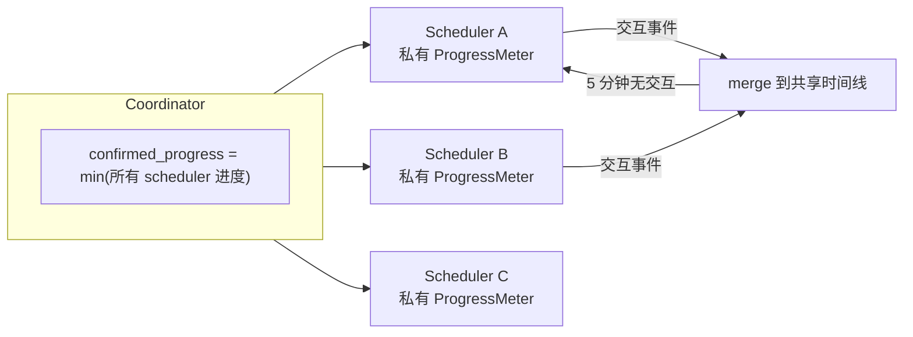

# 二、并行内核：Scheduler 的演变史

> 这条线始于一个领域矛盾：**多角色模拟的因果一致性 vs 并行度**。

## 阶段总览

| 阶段 | 时间 | 方案 | 结局 |
|---|---|---|---|
| Kr1 | 5 月末 | 单角色单时钟 | 无此问题 |
| Kr2 | 6/7–6/17 | 尝试真并行 → 并发 bug 补不完 → 退化为完全串行（所有角色排队走一条时间线） | 跑通但角色互相阻塞：A 发呆 30 秒，B 也卡 30 秒，上限锁死 |
| Kr3 | 6/16–6/21 | **独立时间线假设** | 定型，沿用至今 |

## 核心洞察：独立时间线假设

角色之间**大部分时间不需要因果一致**——A 做饭、B 看书，两条时间线各自推进毫无问题；只有交互（A 对 B 说话）时才需要共享时间线。

据此：

```
Coordinator 管理一组独立 Scheduler
  每个 Scheduler 持有私有进度计量器
  跨实体事件触发 merge（时间线合并）
  5 分钟无交互自动 split
  drift cap 30 保证分离的时钟不会漂移太远
```



**这个设计同时是叙事需求**——男女主各自上班时的心理活动并行推进、下班见面时交汇，多线叙事是引擎原生能力而非补丁。merge / split 不是性能优化，是叙事的正确模型。

## 两轮概念修正

### 1. 删除全局时钟（6/26–6/28）

串行时代遗留的 `storage["clock"]` 在并行架构下**语义错误**——"读到的是谁的钟？"它当时能跑，但在造成真实 bug 之前删掉了它，内核净删 627 行。

替代物是：

> `confirmed_progress = min(所有 scheduler 的进度)`

这是**全系统确认的进度下界**，事件排序、持久化水位线都建立在其上；各插件通过显式参数接收自己 scheduler 的时间，不再读任何全局变量。

这轮重构的性质是**概念正确性**，不是功能也不是性能。`storage["clock"]` 能跑，但它表达了错误的语义。删除它不是清理死代码，是修正一个在并行世界中不再成立的假设。

### 2. 内核去时间化（7/3）

`SimulationClock(datetime)` → `ProgressMeter(int)`，**84 文件重构**（+1,475 / −1,298）。内核只认识抽象进度 int，"时间"是可替换的历法插件（progress↔秒换算 + 日历快照）——换一套异世界历法，其他插件零感知。

事件本身改为 **born-complete**：创建时快照全部上下文，投递路径不再事后查询。

## 并行的正确性工程

每一项都有真实 bug 背书。

- **事件路由下沉**：从 Coordinator 全局串行阶段下沉到各 Scheduler 并行执行，跨 scheduler 级联经**五层显式的生产者–消费者缓冲**（每层的写者、读者、竞态窗口在文档中逐一标注）；
- **单写者原则**：确认进度只由 Coordinator 单协程写入，非 tick 上下文读它无竞态；GATHER 阶段只读、EXECUTE 阶段写入，插件读写分离；
- **entity 准入门**：所有实体（冷启 / 热启 / 磁盘新发现 / 运行时 spawn / 复活）统一走 `registered → prepare → activate → READY → normal tick`，普通 tick 里不存在任何初始化分支。

### 两个真实死锁及修复

| 死锁 | 根因 | 修复 |
|---|---|---|
| buffer 消费死锁 | "未达阈值就 skip → 不消费 → 永远达不到阈值" | always-run 读取与阈值触发分离（破坏"持有并等待"） |
| tick 链断裂 | 调度去重 key 用实体 id，同一 tick 内两个未来调度互相覆盖 | 去重键改为 `(entity, when)` 复合 key |

### chronicle 的分区

编年史分**稳定区 / 波动区**：确认水位线之前的条目不可变（已提交），之后允许乱序重整。这与流处理的 watermark 语义一致——承诺"此后不再有更早的事件"，之前的乱序可重整。

## 概念映射

架构在不断收敛到正确形态的过程中，自然地趋近于 OS 内核的设计。这不是刻意模仿——操作系统是几十年演化的结果，它的核心模式被反复证明正确。

| OS 概念 | 项目映射 |
|---|---|
| 进程调度器 | Coordinator |
| CPU 核心 | Scheduler |
| 进程 | Entity |
| 就绪队列 | TaskQueue |
| 消息队列 / 中断 | EventQueue |
| 逻辑时钟 | `confirmed_progress`（Lamport clock 变体） |
| 时钟同步上限 | drift cap（NTP 变体） |
| NUMA 感知调度 | merge / split（同地点进入同一 scheduler） |
| 进程阻塞 | cooldown（deep / shallow / normal） |
| 轮转调度 | `run_one_tick`（每次只跑一个实体的一步） |
| 中断路由 | Central route |

把 OS 内核的架构思路用于 AI 角色模拟的运行时，是这个项目最核心的原创点。Stanford 的 Smallville（2023）是回合制、单线程、全局时间步——学术界关心 LLM 侧，这里关心系统侧，两条路正交。
